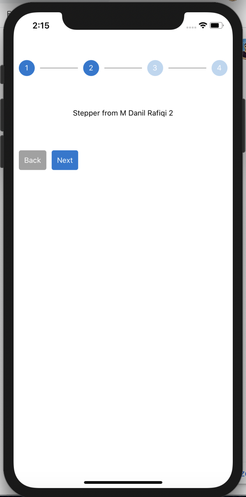
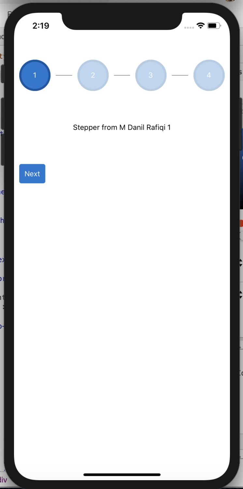
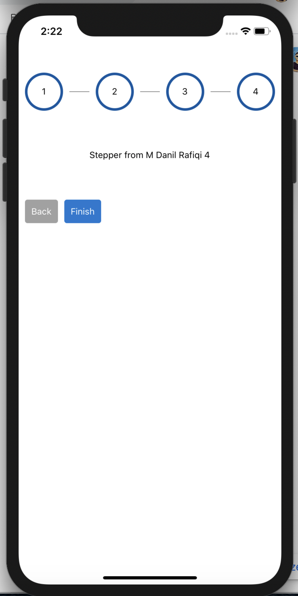

# react-native-stepper-ui

[](http://facebook.github.io/react-native/)
[](https://www.npmjs.com/package/react-native-stepper-ui)
[](https://www.npmjs.com/package/react-native-stepper-ui)
[](https://raw.github.com/danilrafiqi/react-native-stepper-ui/master/LICENSE)

A simple and fully customizable React Native component to create stepper ui.

- Work for android and IOS
- Support typescript
- Customizable

## Table of contents

1. [Example](#example)
2. [Installation](#installation)
3. [Usage](#usage)
4. [Props](#props)

## Example

|                Example One                |                Example Two                |               Example Three               |
| :---------------------------------------: | :---------------------------------------: | :---------------------------------------: |
|  |  |  |

## Installation

If using yarn:

```
yarn add react-native-stepper-ui
```

If using npm:

```
npm i react-native-stepper-ui
```

## Usage

```javascript
import React, { useState } from "react";
import Stepper from "react-native-stepper-ui";
import { View, Alert, Text } from "react-native";
const MyComponent = (props) => {
  return (
    <View>
      <Text>{props.title}</Text>
    </View>
  );
};
const content = [
  <MyComponent title="Component 1" />,
  <MyComponent title="Component 2" />,
  <MyComponent title="Component 3" />,
];
const App = () => {
  const [active, setActive] = useState(0);
  return (
    <View style={{ marginVertical: 80, marginHorizontal: 20 }}>
      <Stepper
        active={active}
        content={content}
        onNext={() => setActive((p) => p + 1)}
        onBack={() => setActive((p) => p - 1)}
        onFinish={() => Alert.alert("Finish")}
      />
    </View>
  );
};

export default App;
```

## Props

| Name               |      Type      | Description                                            | Default                                                                                                                             |
| ------------------ | :------------: | ------------------------------------------------------ | ----------------------------------------------------------------------------------------------------------------------------------- |
| `active`           |     number     | index stepper active                                   | `undefined`                                                                                                                         |
| `content`          | ReactElement[] | Component that render to stepper                       | `undefined`                                                                                                                         |
| `onNext`           |    Function    | Function called when the next step button is pressed   | `undefined`                                                                                                                         |
| `onBack`           |    Function    | Function called when the back step button is pressed   | `undefined`                                                                                                                         |
| `onFinish`         |    Function    | Function called when the finish step button is pressed | `undefined`                                                                                                                         |
| `wrapperStyle?`    |   ViewStyle    | Wrapper component style                                | `{}`                                                                                                                                |
| `stepStyle?`       |   ViewStyle    | Step component style                                   | `{backgroundColor: '#1976d2', width: 30, height: 30, borderRadius: 30, justifyContent: 'center', alignItems: 'center', opacity: 1}` |
| `stepTextStyle?`   |   TextStyle    | Step Text component style                              | `{color: 'white'}`                                                                                                                  |
| `buttonStyle?`     |   ViewStyle    | Button component style                                 | `{ padding: 10, borderRadius: 4, alignSelf: 'flex-start', marginRight: 10, backgroundColor: '#a1a1a1'}`                             |
| `buttonTextStyle?` |   TextStyle    | Button Text component style                            | `{color: 'white'}`                                                                                                                  |
| `showButton?`      |    boolean     | show button                                            | `true`                                                                                                                              |
